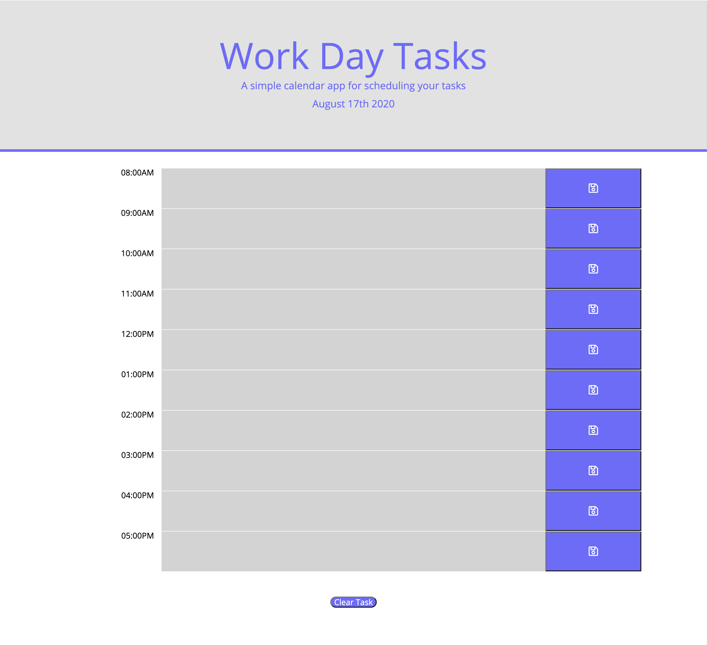

Daily Planner Project

## User Story 

I am creating a daily planner for someone to use. 
I need to store their daily tast in the local storage.
If they reload the page the task will still be there. 

## Project Overview 

1. I looked up the moment.js documentation to see how to idplay time and date. 
2. I made the daily task into an array and object inside that array.
3. Next I wrote functions to store the user input, display the input and how the save button function.
4. Then I worked on the daily planner display. I created a div for the hour, task, and save button. I added the classes in the javaScript with columns from Bootstrap documentation. 
5. Then I wokred on the CSS of the page to make it uniform and clean. 
6. Finaly I worked on and extra element of clearing the data in my array.

## Final Result 

Website: https://tuanasaurus.github.io/dailyPlanner/
GitHub: https://github.com/tuanasaurus